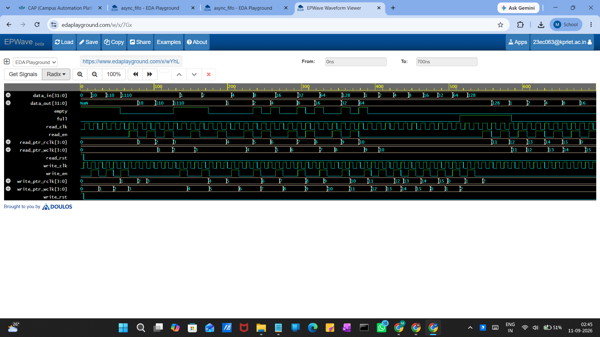

# Asynchronous FIFO (Verilog)

A dual clock domain FIFO written in Verilog, with a Gray-code pointer synchronization scheme to safely move data between two unrelated clocks.

## Why this exists

Most designs eventually have to move data between two clock domains that don't share a common edge — say a 100 MHz processing block writing data and a 66 MHz interface reading it out. You can't just let both sides touch the same pointer registers, because a binary counter can have multiple bits change at once, and if a sampling flop catches that transition mid-flight you get a completely wrong value (not just an off-by-one). That's the classic CDC bug.

The standard fix, and the one used here, is:
1. Convert the write and read pointers to Gray code before crossing domains (only one bit ever changes between consecutive values).
2. Pass them through a 2-stage flip-flop synchronizer into the other clock domain.
3. Convert back to binary once inside the destination domain and compare pointers to generate `full` / `empty`.

## Files

```
asynchronous-fifo/
├── rtl/
│   └── async_fifo.sv       -- FIFO + synchronizer + gray/binary conversion
├── tb/
│   └── async_fifo_tb.sv    -- self-checking-ish testbench, dual clocks
└── README.md
```

## Module: `asyn_fifo`

```
asyn_fifo #(.fifo_depth(8), .fifo_width(32))
```

- `fifo_depth` = 8 entries, `fifo_width` = 32 bits (both are parameters, so you can resize it)
- Write side: `write_clk`, `write_rst`, `write_en`, `data_in`
- Read side: `read_clk`, `read_rst`, `read_en`, `data_out`
- Internally the memory is just `reg [fifo_width-1:0] fifo [fifo_depth-1:0]`

### Pointer logic

The write and read pointers are one bit wider than needed to index the memory (`fifo_depth_log + 1` bits). That extra MSB is the classic trick for telling full apart from empty when both pointers land on the same address — it acts as a wrap-around flag. `full` compares the read pointer (synced into the write domain) against the write pointer with that MSB inverted; `empty` is a straight equality check within the read domain, no crossing needed since both pointers are already local there.

### Crossing the domains

There's a small helper module, `four_bit_parallel_d_ff`, that's really just a generic 4-bit register with async reset. It gets reused four times to build the two synchronizer chains:

- Write pointer → Gray code → 2 flops clocked by `read_clk` → converted back to binary → compared against the read pointer to compute `full`
- Read pointer → Gray code → 2 flops clocked by `write_clk` → converted back to binary → compared against the write pointer to compute `empty`

Two flops (not one) because a single synchronizer flop still leaves a real chance of metastability resolving late; the second stage gives it time to settle before the value is used logically.

The `gray_code()` and `binary()` functions are hand-written combinational conversions (XOR chains), currently fixed for a 4-bit pointer. 
## Testbench

`tb/async_fifo_tb.sv` drives two independent free-running clocks:

- `write_clk`: 10 ns period (5 ns high/low)
- `read_clk`: 12 ns period (6 ns high/low)

Different periods on purpose — the whole point is to exercise the CDC path rather than pretend both sides are synchronous.

It runs through a few scenarios:
- A handful of individual writes followed by reads
- A loop that writes and immediately reads back (`2^i` patterns) to hit the pointer logic across the full range
- A back-to-back write burst to fill the FIFO, then a burst of reads to drain it (this is where you actually see `full` assert if the depth is undersized for the burst)

Waveforms dump to `dump.vcd` via `$dumpfile` / `$dumpvars`, simulation ends at `#700`. Any Verilog/SystemVerilog simulator that supports VCD dumping (Icarus Verilog, ModelSim/Questa, VCS, Xcelium) should run this as-is.

To run with Icarus, for example:
```
iverilog -g2012 -o sim rtl/async_fifo.sv tb/async_fifo_tb.sv
vvp sim
gtkwave dump.vcd
```
## Simulation Waveform

The waveform below shows the asynchronous FIFO simulation with independent read and write clock domains.



## Known limitations / things to improve

- Gray/binary conversion functions are hardcoded to 4 bits — not parameterized with `fifo_depth_log` yet, so changing `fifo_depth` away from 8 will break them silently.
- No explicit metastability model in simulation (RTL simulators don't show it anyway); this only proves functional correctness of the pointer logic, not the physical synchronizer behavior on real silicon.
- Testbench isn't self-checking — no scoreboard or assertions comparing `data_in` history to `data_out`, so pass/fail is currently eyeballed from the waveform.
- `full` and `empty` are purely combinational off the pointer compares; no registered/pessimistic version is provided for timing closure at higher frequencies.

## What I took away from building this

Getting the full/empty logic right with the extra pointer bit took a few tries to actually reason through — it's one of those things that seems obvious once it clicks but is easy to get backwards the first time. The other useful bit was seeing, concretely, why Gray code is the piece that makes crossing a multi-bit counter safe: without it, you'd need to prove every single transition is glitch-free across the whole width, which just isn't true for a binary counter.

---
Manoj Kumar K K — ECE, aiming for VLSI / Design Verification
